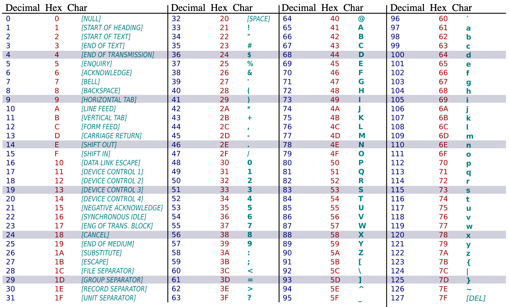

# Reversing Exercise
## Background
The goal of this challenge is to understand your ability to read and understand assembly code.

The majority of our work is on x86-64 assembly. If you are not familiar with x86-64, there is a handy translation between x86 and ARM and a chart of x86-64 register names below in the resource section.

## Challenge
Analyze and explain what the following assembly code does to the best of your ability.

This is a screenshot of the IDA Pro disassembly of a test binary compiled on 64-bit macOS Catalina (10.15.2).

## Resources
### macOS x86-64 System Call Interface
* macOS x86-64 adopts the SystemV AMD64 ABI
* Syscall number is passed in the rax register
* Arguments are passed on the registers in order (left to right): rdi, rsi, rdx, r8, and r9.
* System call is done via the syscall instruction instead of int 0x80
* The base syscall number is 0x20000000

| # | name  | prototype |
| --- | --- | --- |
| 3 | read  | size_t read(int fd, char* buf, size_t len)     |
| 4 | write | size_t write(int fd, char* buf, size_t len)    |
| 5 | open  | int open(char* file, int flags, int mode)      |
| 6 | close | int close(int fd)                              |

### x86 vs ARM

### x86-64 Register Names

### ASCII Table

